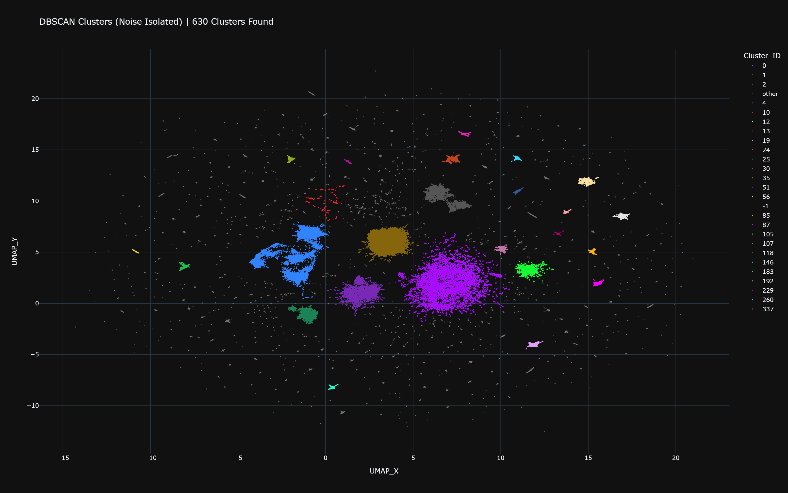

# Steam Game Recommender (SGR)


**Steam Game Recommender (SGR)** is a full-stack, machine-learning-powered web application that provides highly accurate, personalized game recommendations out of a dataset spanning over **162,000+ Steam games**. 

By leveraging **Cosine Similarity** on fully vectorized game features (genres, tags, descriptions), SGR can instantly find titles similar to a user's selected favorites.

## Key Features

- **Blazing Fast ML Inference**: The recommendation engine runs pure linear algebra (`np.dot` with pre-normalized vectors) on `float32` matrices. Compute times for recommendations plummeted from ~16 seconds down to **~130ms**.
- **Smart Game Search**: Includes an intuitive search bar with automated acronym mapping (e.g., searching `cs2` routes to `Counter-Strike 2`, `gta v` routes to `Grand Theft Auto V`).
- **Performance & Memory Optimized**: Designed to run efficiently in Docker containers using Python Garbage Collection overrides and C-level heap trimming (`malloc_trim`) to process huge Parquet matrices without triggering OS-level OOM (Out-of-Memory) killers.
- **Modern UI/UX**: Built with React and Tailwind CSS, featuring snappy animations, responsive layouts, and interactive game cards.
- **End-to-End Pipeline**: Includes complete automated web scraping, data structurization, and ML vectorization pipelines under the hood.

## Tech Stack

### Data Science & Machine Learning
- **Pandas & NumPy**: For heavy data manipulation and multidimensional matrix math.
- **Scikit-Learn**: For feature extraction and vector space modeling (Cosine Similarity).
- **PyArrow (Parquet)**: Highly compressed, columnar data storage for rapid dataset hydration.

### Backend (API)
- **FastAPI & Uvicorn**: Delivering a high-throughput, async REST API.
- **Python 3.12**: Handling file systems, advanced hardware-level garbage collection, and request routing.

### Frontend
- **React (via CRA/Craco) & React Router**: Dynamic client-side routing and state management.
- **Tailwind CSS & Lucide Icons**: Modern dashboard styling and responsive components.

### DevOps
- **Docker & Docker Compose**: Fully containerized multi-tier architecture with live-reloading tied via mounted volumes.

## Project Structure

```text
SGR/
├── data/                    # Local datasets (JSONL, Parquet, Search Index)
├── docs/                    # Walkthroughs & generated plots
├── src/
│   ├── backend/             # FastAPI App, ML inference & Dockerfile (production code)
│   ├── frontend/            # React Codebase, Tailwind configs & Dockerfile
│   ├── data_analysis/       # Everything exploratory/offline, kept out of backend/
│   │   ├── vectorization/   # Feature engineering pipeline (run.py + vectorization_script.py)
│   │   ├── visualization/   # UMAP/DBSCAN cluster notebook
│   │   ├── validation/      # One-off data QA scripts (e.g. price_file_validate.py)
│   │   └── experiments/     # Superseded/prototype scripts kept for reference
│   └── games_scraper/       # Fetch & Structurize Scripts for Steam Data (incl. price_fetcher.ipynb)
├── run_dev.py               # Convenience script: launches backend + frontend dev servers locally
└── docker-compose.yml       # Orchestrates the containers
```

## Getting Started

Follow these steps to run the project locally on your machine.

### Prerequisites
1. Install **[Docker Engine](https://www.docker.com/get-started/)** and ensure it's running.
2. Download the pre-computed ML dataset models.

### Installation

1. **Download the Vectorized Database**: 
   - Navigate to our [Google Drive Data Repository](https://drive.google.com/drive/folders/1hSaK7Kfyjcik1qe9EvCY70DOW7z_iiMU?usp=sharing).
   - Download the `index_table.xlsx` and the `.parquet` files.
2. **Mount the Data**:
   - Inside the repository's `data/` directory, create a folder named `parquet`.
   - Place the downloaded files directly into `data/parquet/`.
3. **Build and Run via Docker**:
   Open a terminal in the project root and spin up the containers:
   ```bash
   docker compose up -d --build
   ```
4. **Access the App**:
   - **Frontend UI**: Go to [http://localhost:3000](http://localhost:3000)
   - **Backend API Docs**: Go to [http://localhost:8000/docs](http://localhost:8000/docs)

## How the Recommender Works

1. **Scraping**: `games_scraper/` routinely hits Steam APIs to retrieve massive chunks of raw `.jsonl` data.
2. **Vectorization**: We clean descriptions, tags, and genres, then vectorize them into a `float32` matrix, finally storing it as a highly compressed `.parquet` file.
3. **Inference**: When a user selects games in their browser, the frontend passes them to FastAPI. The backend looks up the games in an `O(1)` dictionary, pulls their multi-dimensional pre-normalized vectors, averages them (`np.mean`), and calculates distance against the entire **162,000x4,098** matrix dynamically using Numpy dot operations (`np.dot`). The closest similarities are sorted via `argpartition` and returned to the UI instantly.

### Visualizing the Recommendation Space

To sanity-check that the vectorized feature space actually groups similar games together, `src/data_analysis/visualization/vis.ipynb` projects the full **4,098-dimensional** game vectors down to 2D with TruncatedSVD + UMAP, then runs DBSCAN over that projection to surface thematic neighborhoods. Each dense blob below is a cluster of games the recommender considers close in cosine-similarity space; scattered gray points are unclustered "noise" games.



*Static preview above — [open the interactive version](docs/plots/umap_clusters.html) (download and open locally) to pan, zoom, and hover individual game titles.*

##  Design

The original prototype and user experience framework were designed on Figma.  
[View Figma Design Specs](https://www.figma.com/design/X0vyohfhJrMyU7qfeGo6Ll/Untitled?node-id=0-1&p=f&t=1YmrUn7rBX9DdiE7-0)