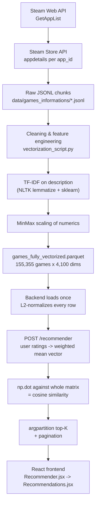

# How the SGR Recommender Works — An Interview Walkthrough

This is the walkthrough I'd give in a data scientist interview if asked to explain a production
(-ish) recommender system I built end-to-end: how the data is gathered, how it becomes a feature
matrix, how the model actually scores similarity, how it's served, and how the frontend uses it.

The one-line pitch: **it's a content-based recommender that uses cosine similarity over a
hand-engineered feature matrix (genres, tags, developers/publishers, TF-IDF of the game
description, and scaled numeric metadata) — no collaborative filtering, no user history, no
neural embeddings.** Given a small set of games a user rates, it builds one "taste vector" and
returns the closest games in the catalog by cosine distance.



---

## 1. Framing the problem

There's no purchase history, no click logs, no explicit user-item rating matrix at scale — this
is a **cold-start-by-design** situation, which is common for a side project or a new product
surface. So collaborative filtering (matrix factorization, ALS, etc.) is off the table from day
one: there simply isn't a dense enough interaction matrix to factorize.

What *is* available is rich **item metadata** from the Steam store itself: genres, tags,
developer/publisher, description text, price, achievement count, release date. That pushes the
design toward **content-based filtering**: represent every game as a vector in a shared feature
space, and recommend whatever is geometrically closest to the games a user says they like.

The one piece of "personalization" signal we do get is a 1–10 rating the user gives each seed
game, which lets us weight a multi-game query instead of treating every input game equally.

---

## 2. Data gathering (`src/games_scraper/fetch_structurize.pyw`)

Two Steam endpoints, used in sequence:

1. **`ISteamApps/GetAppList`** — a one-shot bulk endpoint that returns essentially every App ID
   Steam has ever issued (~162,941 of them at collection time), dumped to
   `data/games_id_all.json`. This is the universe of items to potentially recommend.
2. **`store.steampowered.com/api/appdetails?appids=<id>`** — hit once per App ID to pull full
   store metadata (name, genres, categories, developers, publishers, price, description,
   achievements, DLC, release date, supported languages, etc).

A few things worth calling out because they're the unglamorous-but-necessary part of any real
scraping job:

- **Rate limiting**: a hardcoded `time.sleep(1.5)` between requests to stay under Steam's
  informal rate limits — no backoff/retry logic, just a fixed delay.
- **Resumability**: every attempted App ID (success *or* failure) is appended to
  `attempted_ids.txt` with its HTTP status code. On every run, the script loads that file first
  and skips anything already attempted — so a scrape that dies at ID 80,000 out of 162,000 can
  just be restarted and it'll pick up where it left off instead of re-fetching everything.
- **Chunked output**: results are written as **JSONL** (one JSON object per line, not one giant
  JSON array) into `games_chunk_N.jsonl` files capped at 10,000 lines each
  (`data/games_informations/`). JSONL is the right call here for two reasons: it's
  append-friendly (you can `open(..., 'a')` and write a line without re-serializing the whole
  file), and it's streamable (the downstream loader reads line-by-line instead of holding one
  150MB JSON blob in memory to parse it).
- **Trimming at the source**: `structurize_game_output` strips fields we'll never use (raw
  screenshots, movies, legal notices, platform requirement strings, formatted price strings,
  metacritic blobs) *before* writing to disk — cheaper to throw away noise once at scrape time
  than to carry it through every downstream step.

Output shape per line: `{"<appid>": {"name": ..., "genres": [...], "developers": [...],
"about_the_game": "...", "price_overview": {...}, "achievements": {...}, "release_date": {...},
"dlc": [...], ...}}`.

There's a companion `data/games_prices/` dataset (also JSONL, `price_data_chunk_*.jsonl`) that
tracks price/discount history over time for the price-prediction feature — that's a separate
LightGBM-based subsystem (`src/backend/discount_prediction.py`) and isn't part of the similarity
recommender, so it's out of scope here.

---

## 3. Cleaning & feature engineering (`src/data_analysis/vectorization/vectorization_script.py`)

This is the offline batch job (`run.py` glob's every chunk file and calls `process_pipeline`) that
turns ~155k raw JSON blobs into one numeric matrix. Step by step:

**Language filter.** Non-English games are dropped up front (`supported_languages` doesn't
contain "English"). This is a deliberate scope-narrowing decision — description-based TF-IDF only
makes sense within one language, and English is the dataset's dominant language, so rather than
build a multilingual pipeline, the simpler fix is to filter.

**Column pruning.** Drop everything that's presentation-only or redundant for similarity
purposes: header images, raw review text, support info blobs, the game's store URL, DRM notices.

**List/dict normalization.** Steam's API returns things inconsistently — `genres` and
`categories` come back as `[{"description": "Action"}, {"description": "Indie"}]`, while
`developers`/`publishers` are plain string lists. Two small helpers (`clean_list`,
`clean_dict_list`) normalize both shapes down to flat lists of strings.

**One-hot encoding with cardinality control.** `genres` and `categories` get a full
`MultiLabelBinarizer` — there just aren't that many distinct values (33 genres, 58 categories in
the final matrix), so one column per value is cheap. `developers` and `publishers` are a
different story: there are tens of thousands of distinct studios, and one-hotting all of them
would blow up the matrix for almost no signal (most developers made exactly one game in the
dataset — useless for a similarity model). So those two get **capped to the top-N most frequent**
via `settings.json` (`max_developers: 1000`, `max_publishers: 500`) — everything outside the top N
just doesn't get a column, effectively saying "developer identity only matters as a similarity
signal for prolific studios like Ubisoft or EA."

**Numeric feature extraction from nested structures**: `dlc_count` (length of the `dlc` list),
`achievements_count` (`achievements.total`), `release_year` (parsed out of
`release_date.date` via `pd.to_datetime`), `recommendations` (Steam's own "recommended by N
users" count), and `price_overview.initial` as a raw price float.

**A subtle bug worth flagging**: `controller_support` is coerced to a string `'0'`/`'1'`
(`.fillna('0').str.replace('full', '1')`) but never cast to numeric or included in the
`scaling()` step. It survives into the final parquet as a **string column**. It still gets cast to
`float32` successfully at serving time (pandas can quietly parse numeric-looking strings), but
it's dead weight sitting un-scaled next to MinMax-scaled numeric features and one-hot binary
features — a good example of the kind of feature-scaling inconsistency that's easy to miss in a
pipeline with 4,000+ columns and worth catching in a code review.

---

## 4. Text features: TF-IDF over the game description (`nlp_part`)

The `about_the_game` HTML blurb is the only free-text signal in the pipeline, and it's what lets
two games with identical genre tags ("Action", "Indie") but very different vibes (a cozy pixel
platformer vs. a gore-soaked roguelike) end up in different parts of the vector space.

Processing: lowercase → regex tokenize (`\b[a-z0-9\-]+\b`) → **lemmatize** each token with NLTK's
`WordNetLemmatizer` (so "zombies", "zombie" collapse to one token) → `TfidfVectorizer` with
`stop_words='english'`, `max_features=2500`, `min_df=10` (a term must appear in ≥10 games to get
a column — kills scraped junk/typos), `max_df=0.85` (drop terms so common they're meaningless,
like "game" or "play"). Each surviving term becomes an `nlp_<term>` column — 2,500 of the
matrix's 4,100 columns are TF-IDF weights.

TF-IDF is a deliberately simple choice over something like sentence embeddings (e.g. a
sentence-transformer). It's fast to fit over 155k documents, has zero GPU/inference-time
dependency, and produces a sparse, interpretable vector (you can literally point at which words
drove a similarity score). The tradeoff is it's a bag-of-words model — no synonymy, no word
order, no semantic understanding beyond shared vocabulary. That's the single biggest lever I'd
pull first if asked "how would you improve this" (see §10).

---

## 5. Scaling and assembling the final matrix

`MinMaxScaler` is applied per-column to `price_overview`, `recommendations`, `dlc_count`,
`achievements_count`, and `release_year` — squashing each into `[0, 1]` so that, say, a game
review count in the tens of thousands doesn't dominate a cosine similarity computation purely
because of its raw magnitude compared to a one-hot genre flag of 0 or 1.

Everything gets concatenated into one `DataFrame`: `[name, is_free, price_overview,
recommendations, controller_support, genres_*, categories_*, developers_*, publishers_*,
dlc_count, achievements_count, release_year, nlp_*]`, remaining NaNs filled with 0, and column
names forced to plain strings (Parquet is picky about column name types).

`run.py` writes two artifacts:
- `data/parquet/games_fully_vectorized.parquet` — the actual matrix, **155,355 rows × 4,100
  columns**, stored as Parquet specifically because it's columnar and compresses this kind of
  mostly-sparse, mixed-numeric data far better than CSV/JSON (this is a batch artifact, rebuilt
  offline whenever the scraped data changes — it is *not* regenerated per-request).
- `data/parquet/index_table.xlsx` — a simple `name → row index` lookup, mostly useful for
  debugging/data exploration rather than serving.

---

## 6. Serving: how a request actually gets scored (`src/backend/cosine_similarity.py`)

This is the part that would come up if the interviewer asks "walk me through what happens when a
user hits submit."

**Lazy singleton load.** `_load_data_if_needed()` reads the Parquet file into memory exactly once
per process (guarded by a module-level `None` check), builds a `name → row index` dict for O(1)
lookup, and casts the whole feature block to `float32` (half the memory of `float64`, plenty of
precision for a bounded [0,1]-ish feature space).

**Pre-normalization is the key performance trick.** Every row is L2-normalized once, up front:

```python
norms = np.linalg.norm(raw_matrix, axis=1, keepdims=True)
norms[norms == 0] = 1.0
_all_games_matrix_normalized = raw_matrix / norms
```

Cosine similarity between two vectors is `(a · b) / (‖a‖‖b‖)`. If every row is already unit
length, that denominator is just `1`, so cosine similarity degenerates into a **plain dot
product**. This is why the whole matrix can be scored against a query in one BLAS-backed
`np.dot` call instead of computing norms per-request — the README's "~16s → ~130ms" number comes
directly from this: move the expensive normalization to a one-time load cost, and every
subsequent request becomes a single dense matrix-vector multiply.

**Building the query vector.** The frontend sends `[{"Half-Life 2": 8}, {"Portal": 10}]`. For
each entry:
1. Look up the game's row / pre-normalized vector.
2. Scale it by `rating / 10.0` — so a 10/10 counts fully, a 5/10 counts at half-weight.
3. Collect all scaled vectors, take their **mean**, then **re-normalize** that mean vector to
   unit length.

Worth noting (and a good interview gotcha if I'm asked "does the rating actually matter?"): with
a **single** input game, scaling by a constant and then re-normalizing to unit length cancels the
scalar out completely — a lone game rated 1/10 produces the *exact same* recommendations as the
same game rated 10/10, because you're just rescaling a vector and immediately normalizing away
that rescale. Rating weight only changes the outcome once there are ≥2 games with *different*
ratings, because then the relative weighting between vectors shifts the *direction* of the mean,
not just its magnitude. I verified this empirically when testing the API — worth knowing cold in
an interview rather than getting caught out by it live.

**Scoring and filtering.** `np.dot(matrix, query_vector)` scores the entire catalog in one shot.
Input games are excluded from their own results by forcing their similarity to `-1` post-hoc
(simpler than filtering rows out of the matrix, which would require re-indexing).

**Top-K selection.** `np.argpartition` finds the top `offset + limit` candidates in **O(n)**
average time (it's a partial-sort / quickselect, unlike a full `argsort` which is
O(n log n)) — then only *that* small slice gets fully sorted by score. For a catalog of 155k
games and a page size of 15, this matters: you're paying full-sort cost on ~15-30 items instead
of 155,000.

**Pagination** is just array slicing on the sorted top-K result using `offset`/`limit` — the
frontend's "load more" button re-POSTs the same rated games with a larger `offset`.

---

## 7. The API layer (`src/backend/main.py`)

FastAPI, deliberately thin — it's a routing/validation layer over the modules above, no business
logic of its own:

| Endpoint | Purpose |
|---|---|
| `POST /recommender` | Pydantic-validated body (`movie_list`, `limit`, `offset`) → `cs_recommender(...)` |
| `GET /search?q=` | Substring search over a pre-built `search_index.json`, with a hardcoded acronym dictionary (`cs2` → `Counter-Strike 2`, `gta v` → `Grand Theft Auto V`) so users don't need to type exact titles |
| `GET /games?ids=` | Bulk fetch by Steam App ID — used when the frontend already knows which cards are selected |
| `GET /games_by_name?names=` | Bulk fetch by title — used to enrich the *bare* `{name: score}` recommender output with cover art, price, genre for rendering |
| `GET /game/{id}` / `/price-history` / `/price-predictions` | Game detail + the separate discount-prediction feature, unrelated to similarity scoring |

The recommender endpoint itself returns just `[{"Cyberpunk 2077": 0.82}, ...]` — bare
name-and-score pairs. It deliberately doesn't return cover images, prices, or genres; that's a
separate concern the frontend resolves via `/games_by_name` (see below). This keeps the hot path
(the actual similarity math) free of any dependency on the metadata-lookup path, and means the two
data sources (the ML matrix vs. the display-metadata JSON index) can evolve independently.

---

## 8. Frontend flow (React)

**Selection UI — `Recommender.jsx`.** The user browses/searches their (mock) library, selects
≥2 games, optionally rates each 1–10 via a slider. On submit, it builds a payload string like
`"Half-Life 2::8||Portal::10"`, URL-encodes it, and navigates to
`/recommendations?payload=...` — state is passed through the URL rather than global state/context,
which makes the results page shareable/bookmarkable and trivially reloadable.

**Results — `Recommendations.jsx`.** Parses that payload back into `{title, rating}` pairs,
`POST`s to `/recommender`, then does a **second** fetch to `/games_by_name` to hydrate each bare
result with cover art, price, and genre for the card UI. It also fetches a public FX-rate API
(`open.er-api.com`) client-side to convert any non-PLN prices for display — that's a
presentation-layer concern, not something the backend needs to know about.

**Client-side filtering.** Price range, platform, and genre filters (the sidebar on the results
page) are applied with `useMemo` **after** the API call returns — they filter the already-fetched
page of results, they don't re-query the backend. That's a real product tradeoff worth flagging
in an interview: it's simple and fast to implement, but it means "load more" fetches another page
of *raw, unfiltered* similarity results, and if a user's filters are aggressive, they can end up
clicking "load more" several times and see very few (or zero) cards actually appear, because
filtering happens client-side after the fact rather than being pushed into the `/recommender`
query itself.

---

## 9. Performance engineering, summarized

- `float32` everywhere instead of `float64` → half the memory footprint for a 155k×4,100 matrix.
- Normalize once at load time, not per request → cosine similarity becomes a single dot product.
- `argpartition` instead of `argsort` for top-K → O(n) instead of O(n log n) on every request.
- Parquet + a lazy, process-global singleton load → the ~150MB matrix is read from disk exactly
  once per backend process, not once per request.
- The README also mentions Docker-level tuning (Python GC overrides, `malloc_trim`) to keep this
  matrix from tripping OOM killers in constrained containers — a detail worth mentioning if asked
  about productionizing a model that has to live alongside a memory-limited container.

---

## 10. Limitations, and what I'd improve given more time

This is the section I'd expect to spend the most time on in an actual interview — showing you
understand the tradeoffs you made, not just that the thing works.

1. **No collaborative signal at all.** Two users with wildly different but equally valid tastes
   who both like "Portal" get identical recommendations. There's no mechanism to learn "people who
   liked X also liked Y" — everything is driven by item features alone. A natural next step would
   be a hybrid: blend this content-based score with an implicit-feedback collaborative model
   (e.g. ALS on play-time or purchase co-occurrence) once real usage data exists — solving the
   literal cold-start problem this design was built around, but only after the cold-start period.
2. **Bag-of-words text features.** TF-IDF has no notion of semantic similarity — "spooky" and
   "horror" are unrelated dimensions to it. Swapping in sentence embeddings (or even a
   pretrained word2vec/GloVe average) for the description would likely improve recall for
   thematically-similar-but-differently-worded games, at the cost of needing an embedding
   model in the serving path.
3. **Fixed, hand-picked feature weighting.** Genres, TF-IDF terms, and developer one-hots all sit
   in the same vector with no learned weighting between feature groups — a genre match and a
   single shared TF-IDF term contribute comparably to the dot product purely by construction, not
   because that's been validated as correct. A learned metric (e.g. a Siamese network trained on
   click-through pairs, or even just tuning per-block weights against an offline eval set) would
   be a more principled approach.
4. **No offline evaluation loop.** There's no held-out metric being tracked (precision@K,
   NDCG, diversity) — changes to the pipeline (e.g. bumping `max_features`) are validated by eye,
   not by a number. The very first thing I'd add before touching the feature engineering again is
   some offline evaluation harness, even a crude one based on genre-match rate on held-out pairs.
5. **No diversity / re-ranking step.** Top-K by raw similarity can easily return five near-clones
   of the same franchise (as seen in testing: rating one Half-Life title highly surfaces nearly
   every other Half-Life-engine game before anything else). A maximal-marginal-relevance-style
   re-ranking pass would trade a little precision for noticeably better perceived variety.
6. **Single-rating-cancels-out quirk** (§6) is a subtle correctness issue if the product intent is
   "let users express how much they like each seed game" — right now that only works when
   multiple seed games are rated differently. Worth a product conversation about whether that
   matches user expectations.
7. **Client-side filtering after a fixed-size API page** (§8) means filters can starve the results
   grid. Pushing genre/platform/price filters into the `/recommender` query (or over-fetching and
   filtering server-side before paginating) would fix that.
8. **Static top-N developer/publisher cutoff** (§3) is an unvalidated cardinality-reduction
   heuristic — reasonable, but "1000 developers, 500 publishers" was a design constant, not the
   output of an actual empirical study on the true information gain of the tail slice.

---

## 11. Questions I'd expect as follow-ups (and how I'd answer)

**"Why cosine similarity instead of Euclidean distance or a nearest-neighbor index like
FAISS/Annoy?"**
Cosine similarity is scale-invariant, which matters here because the feature vector is a mix of
sparse binary one-hots and TF-IDF weights of very different natural magnitudes — Euclidean
distance would let a handful of high-magnitude dimensions dominate. On the ANN question: brute
force (`np.dot` against every row) is intentionally fine at this scale (155k rows, 4,100 dims,
fits in memory, sub-150ms per query) — an ANN index would add engineering complexity (build time,
approximate results, index staleness on data updates) to solve a latency problem that doesn't
exist yet. I'd reach for FAISS/HNSW the moment the catalog got another couple orders of magnitude
bigger, or if p99 latency became a real constraint.

**"How would you know if this is actually a *good* recommender, not just a fast one?"**
Honestly — right now, you wouldn't, beyond spot-checking outputs (which is what I did:
rating "The Witcher 3" highly correctly surfaced Cyberpunk 2077 and The Witcher 2, both CD
Projekt Red RPGs). That's an anecdote, not evidence. Getting real signal needs either an offline
proxy metric (e.g., "does the top-K contain a game from the same genre/franchise as a held-out
game the user is known to like") or, better, an online A/B test measuring click-through or
add-to-wishlist rate on recommended cards versus a random/popularity baseline.

**"What happens if I rate a game that isn't in the catalog?"**
Silently ignored — `cs_recommender` does `_name_to_index.get(movie)` and only accumulates vectors
for names it can resolve; if *none* resolve, it returns `[]`. That's a reasonable default
(don't 500 the request over a typo) but it does mean a misspelled title fails silently with no
user-facing signal about *why* results look empty — the frontend's "Brak wyników" (no results)
state doesn't distinguish "your filters are too strict" from "we didn't recognize your games."

**"Why Parquet instead of, say, a real vector database?"**
At this scale and access pattern — one bulk read into memory at process start, no per-request disk
I/O, no need for approximate search, updates happen via a full offline rebuild rather than
incremental upserts — a columnar file format is the right level of infrastructure. A vector DB
(pgvector, Pinecone, Milvus) would earn its keep once there's a need for incremental updates
without a full reprocessing job, multi-tenant filtering pushed into the similarity query itself,
or a catalog too large to comfortably fit in one process's memory.
